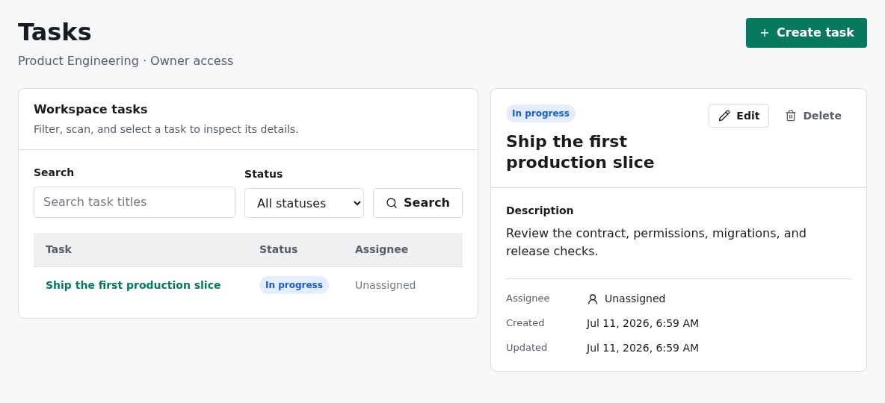
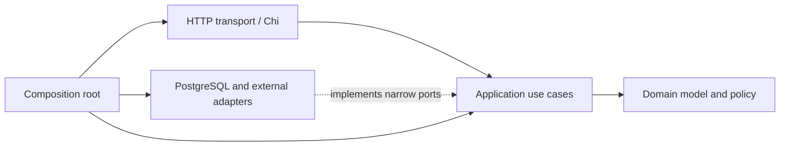

<div align="center">
  <h1>Yoruplate</h1>
  <p><strong>A production-oriented full-stack template for SaaS and internal tools.</strong></p>

  <p>
    Start with clear backend boundaries, one API contract, session security, an accessible React interface, PostgreSQL, and deterministic quality gates.
  </p>

  <p>
    <!-- template-source-only:start -->
    <a href="https://github.com/yorukot/yoruplate/actions/workflows/ci.yaml"></a>
    <!-- template-source-only:end -->
    <a href="./LICENSE"></a>
    
    
  </p>
</div>

<p align="center">
  <picture>
    <source media="(prefers-color-scheme: dark)" srcset="./docs/assets/readme-reference-slice-dark.png" />
    <source media="(prefers-color-scheme: light)" srcset="./docs/assets/readme-reference-slice.png" />
    
  </picture>
</p>

---

Yoruplate is an open-source product baseline for teams that want to begin with the difficult cross-cutting decisions already made and enforced. It uses a Go modular monolith, TypeSpec-first HTTP contract, feature-owned React client, semantic UI system, PostgreSQL, and production-shaped deployment.

Most starter repositories prove that a page can render and a row can be saved. This template also proves authentication, workspace roles, transaction ownership, stable problem responses, CSRF protection, generated clients, cache reconciliation, responsive workflows, migrations, observability, and CI boundaries.

The included Workspace and Tasks workflow is a reference slice, not disposable demo code. Extend its boundaries when you add the next feature.

## Quick Start

### Requirements

Install Docker with Compose to run the production-shaped stack. Node.js 22.12 or newer and pnpm 11.11.0 are required for initialization and source development.

<!-- template-source-only:start -->

Starting a new project additionally requires Git.

Clone the source template and run the one-time initializer:

```bash
git clone https://github.com/yorukot/yoruplate.git
cd yoruplate

pnpm run template:init -- \
  --name "Acme Console" \
  --slug acme-console \
  --go-module github.com/acme/console \
  --npm-scope @acme-console \
  --env-prefix ACME_CONSOLE \
  --cookie-prefix acme_console
```

The initializer installs dependencies, changes only its managed source allowlist, regenerates the API artifacts, and records `.template-initialized.json`. It refuses a second successful run. If installation or validation fails, it restores the managed source files and template markers so the same command can be retried safely.

<!-- template-source-only:end -->

Start the complete stack:

```bash
cp deployments/docker/example.env deployments/docker/.env
docker compose --env-file deployments/docker/.env -f deployments/docker/compose.yaml up --build
```

Open `http://localhost:3000`. Compose waits for PostgreSQL, runs the one-shot migration, and starts the non-root application only after migration succeeds.

> [!IMPORTANT]
> The example environment is for localhost only. Before exposing an instance, replace every `change-me` value, set `PROJECT_TEMPLATE_ENV=production`, set `PROJECT_TEMPLATE_SESSION_COOKIE_SECURE=true`, use a `__Host-project_template_session` cookie name, configure explicit database and CSRF origins, use HTTPS, and pin an image version.

To stop the stack:

```bash
docker compose --env-file deployments/docker/.env -f deployments/docker/compose.yaml down
```

## What You Get

| Area       | Included baseline                                                                                                          |
| ---------- | -------------------------------------------------------------------------------------------------------------------------- |
| Backend    | Go modular monolith with domain, application, transport, infrastructure, and composition-root boundaries                   |
| Contract   | TypeSpec as the wire source, OpenAPI 3.1, embedded backend schema, and generated TypeScript declarations                   |
| Security   | Opaque sessions with keyed hashes, HttpOnly cookies, CSRF and origin validation, stable authorization policy               |
| Data       | PostgreSQL 17, pgx, sqlc, Goose migrations, application-owned transactions, and database invariants                        |
| Web        | React 19, React Router, TanStack Query, typed API adapters, URL-owned filters, and complete workflow states                |
| UI         | Semantic light and dark tokens, Radix primitives, Lucide icons, Storybook, keyboard behavior, and targeted axe checks      |
| Operations | Multi-stage non-root image, migration-gated Compose, Zap logs, Prometheus metrics, and OpenTelemetry traces                |
| Quality    | Architecture tests, generated drift detection, linting, unit and integration tests, and desktop/mobile Playwright coverage |

The baseline is deliberately domain-neutral. It does not include product-specific agent runtimes, remote installers, job assignment, or monitoring domain code.

## Reference Slice

The reference UI implements registration, session authentication, workspace creation and switching, URL-owned task filters, and task create/read/update/delete behavior.

| Role   | Workspace and member administration | Task reads | Task writes |
| ------ | ----------------------------------- | ---------- | ----------- |
| Owner  | Yes                                 | Yes        | Yes         |
| Editor | No                                  | Yes        | Yes         |
| Viewer | No                                  | Yes        | No          |

The production-stack browser suite covers registration, workspace and task creation, sign-out and sign-in, viewer read-only controls, and a direct viewer API write that must return `403`.

## Architecture At A Glance



The dependency rules are executable:

- Domain remains independent from outer project layers.
- Application owns authorization, transaction scope, narrow ports, and stable errors.
- Infrastructure implements application ports and translates dependency failures.
- HTTP decodes protocol input, invokes one use case, and maps the result to the public contract.
- The composition root is the only place that wires concrete adapters.

The contract has one source and three checked consumers:

```text
api/**/*.tsp
  -> docs/public/openapi.json
  -> server/internal/controller/transport/http/openapi/openapi.json
  -> web/src/shared/api/openapi.d.ts
```

Run `pnpm generate` after changing TypeSpec. `pnpm generated:check` regenerates into a temporary directory and rejects drift without changing committed artifacts.

Read [ARCHITECTURE.md](./ARCHITECTURE.md) before changing dependency direction and [design.md](./design.md) before extending the browser interface.

## Develop From Source

Source development additionally requires Go 1.23.5, PostgreSQL 17 reachable from the host, `just` 1.40.0, and `golangci-lint` 2.11.4.

Install workspace dependencies, create a local runtime file, and point its database URL at your PostgreSQL instance:

```bash
pnpm install
cp server/.env.example .env
# Edit PROJECT_TEMPLATE_DATABASE_URL in .env.
just backend-migrate-up
```

Run the backend and web client in separate terminals:

```bash
just backend-dev
```

```bash
just web-dev
```

| Surface                       | Command              | URL                              |
| ----------------------------- | -------------------- | -------------------------------- |
| Production-shaped app and API | `just docker-up`     | `http://localhost:3000`          |
| Web development server        | `just web-dev`       | `http://localhost:5173`          |
| Backend development server    | `just backend-dev`   | `http://localhost:8080`          |
| Documentation                 | `just docs-dev`      | `http://localhost:4321`          |
| API explorer                  | `just docs-dev`      | `http://localhost:4321/openapi/` |
| Storybook                     | `just storybook-dev` | `http://localhost:6006`          |

## Common Commands

| Command                         | Purpose                                                                                      |
| ------------------------------- | -------------------------------------------------------------------------------------------- |
| `just ci`                       | Run formatting, generated drift, lint, type checks, tests, and all production builds         |
| `pnpm generate`                 | Regenerate OpenAPI and web contract declarations from TypeSpec                               |
| `pnpm generated:check`          | Reject generated contract drift without mutating source                                      |
| `just backend-test`             | Run Go unit and architecture tests                                                           |
| `just backend-test-integration` | Run PostgreSQL repository and transaction tests against `PROJECT_TEMPLATE_TEST_DATABASE_URL` |
| `just docs-dev`                 | Start the Astro documentation and API explorer                                               |
| `just storybook-dev`            | Start the shared UI workbench                                                                |
| `just clean`                    | Remove local build, coverage, Storybook, and browser-test output                             |

Service-backed CI separately runs PostgreSQL integration tests, a Docker build and health check, and the desktop/mobile Playwright workflow.

## Repository Map

| Path                  | Ownership                                                                    |
| --------------------- | ---------------------------------------------------------------------------- |
| `api/`                | TypeSpec models and HTTP operations                                          |
| `server/`             | Go domain, use cases, adapters, transport, migrations, and integration tests |
| `web/`                | React routes, feature workflows, browser infrastructure, and E2E tests       |
| `packages/ui/`        | Domain-neutral tokens, primitives, tests, and Storybook stories              |
| `docs/`               | Astro guides, reference documentation, generated OpenAPI, and API explorer   |
| `deployments/docker/` | Image, Compose stack, migration gate, and optional observability profile     |
| `scripts/`            | Initializer, contract generation, drift checks, and frontend policy checks   |

## Documentation

- [Getting started](./docs/src/content/docs/guides/getting-started.mdx)
- [Architecture reference](./docs/src/content/docs/reference/architecture.mdx)
- [Configuration and production rules](./docs/src/content/docs/reference/configuration.mdx)
- [Deployment](./docs/src/content/docs/reference/deployment.mdx)
- [API explorer and contract flow](./docs/src/content/docs/guides/api-explorer.mdx)
- [UI system](./docs/src/content/docs/reference/ui-system.mdx)
- [Generated OpenAPI 3.1 document](./docs/public/openapi.json)

## Contributing

Read the root [AGENTS.md](./AGENTS.md), [ARCHITECTURE.md](./ARCHITECTURE.md), and [design.md](./design.md) before making structural changes. Keep feature behavior in its owning area, regenerate contracts in the same change, and run `just ci` before opening a pull request.

<!-- template-source-only:start -->

[Issues](https://github.com/yorukot/yoruplate/issues) and [pull requests](https://github.com/yorukot/yoruplate/pulls) are welcome.

<!-- template-source-only:end -->

## Influences

Yoruplate distills engineering patterns exercised in [Netstamp](https://github.com/yorukot/Netstamp): a deployable modular monolith, consumer-owned ports, a single wire contract, executable architecture rules, and migration-aware operations.

## License

Yoruplate is available under the [MIT License](./LICENSE).
