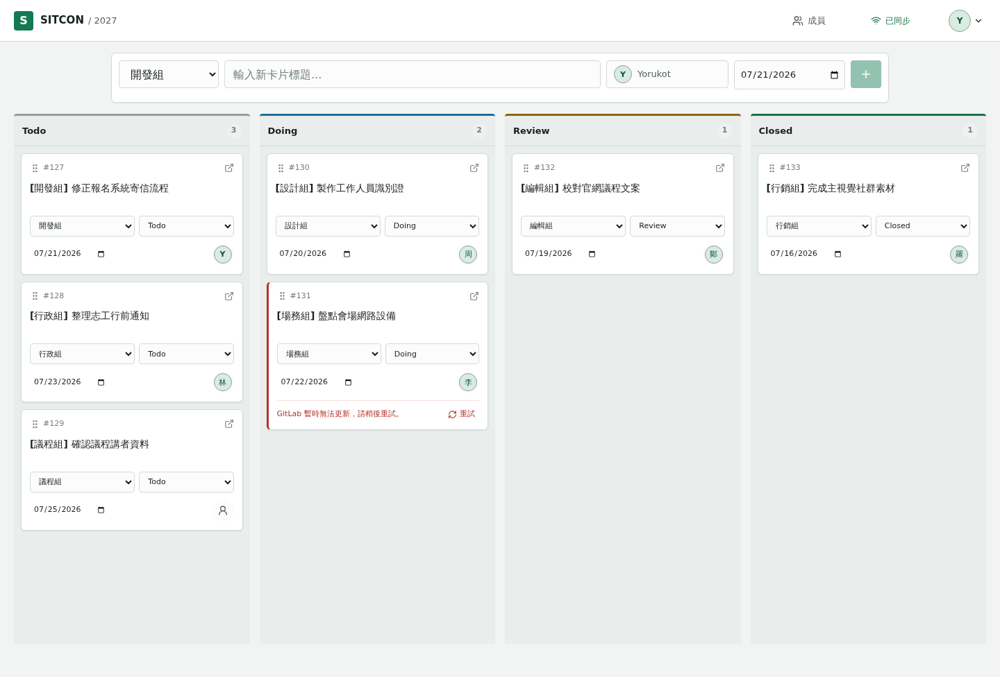

# SITCON Board

SITCON 2027 籌備工作的 GitLab-backed 看板。登入、選擇主要組別、開卡、移動、指派與關閉都在同一個快速工作面完成。

正式資料來自兩個固定來源：本 GitHub repository 的 [`.sitcon/board-directory.yml`](./.sitcon/board-directory.yml) 提供組別、Title prefix 與 labels；GitLab `sitcon-tw/2027` 的 Project Members 提供可指派成員，issues 提供 Board 卡片。前端不內建正式組別或成員資料。



## 核心行為

- GitLab OAuth Authorization Code + PKCE，只允許 active project members 登入。
- 隨機 opaque session token 放在 HttpOnly cookie，PostgreSQL 只保存 keyed digest。
- Session 固定 14 天 rolling expiry；每次有效使用都會續期資料庫 expiry 與 cookie。
- Authenticated mutations 同時驗證 session-bound CSRF token 與 Origin。
- Go 啟動時先同步 directory、members、board snapshots；沒有 snapshot 不會通過 readiness。
- Go 回傳 SPA HTML 時注入完整 bootstrap，React 第一次 render 不等待額外 API。
- Board 固定依序顯示 `Wating`、`Inbox`、`To Do`、`Doing`、`Review`、`Closed` 六欄。
- 前五欄分別對應 GitLab scoped labels `Status::Waiting`、`Status::Inbox`、`Status::To Do`、`Status::Doing`、`Status::Review`；`Closed` 對應 issue closed state。
- 卡片詳細視窗可編輯 title、Markdown description、組別、狀態、多人 Assignee，以及 GitLab issue 的 Start/Due dates；Markdown 提供 GFM 預覽。
- 開卡、詳細規劃、移動、多人指派、期限與組別調整先寫 PostgreSQL optimistic cache 與 durable operation，再由 worker 同步 GitLab。
- GitLab signed project/group webhooks 觸發 targeted catch-up；PostgreSQL revision 與 SSE 讓已開啟的看板立即 refetch，既有 polling 負責漏訊恢復。
- GitLab 暫時離線時仍顯示最後一次成功的 Board，失敗操作可重試。
- 正常背景刷新與 optimistic pending 不顯示技術狀態；只有離線或操作失敗會出現在 UI。

## 架構

```text
GitLab signed webhooks ------> durable webhook inbox
                                      |
Bundled directory + GitLab API ---> PostgreSQL snapshots + revision
                                      |
                         injected bootstrap + REST + SSE
                                      |
                                  React Board
```

`api/**/*.tsp` 是 HTTP contract 唯一來源，生成並提交三份 review artifacts：

```text
docs/public/openapi.json
server/internal/controller/transport/http/openapi/openapi.json
web/src/shared/api/openapi.d.ts
```

Backend dependency direction 與 durable operation 細節見 [ARCHITECTURE.md](./ARCHITECTURE.md)，瀏覽器視覺規則見 [design.md](./design.md)。

## 本機開發

需要 Go 1.23.5、Node.js 22.12+、pnpm 11.11.0、PostgreSQL 17 與 `just` 1.40.0。

```bash
pnpm install
cp server/.env.example .env
# 設定 SITCON_BOARD_DATABASE_URL 與 GitLab credentials
just backend-migrate-up
```

分別啟動 backend 與 web：

```bash
just backend-dev
```

```bash
just web-dev
```

Web 開發伺服器位於 `http://localhost:5173`，並將 `/api` proxy 到 `http://localhost:8080`。

純 UI 檢查可明確啟用測試資料：

```bash
VITE_SITCON_DEMO=true just web-dev
```

Demo fixture 只會在這個 flag 為 `true` 時動態載入，不是 production data source。

## Docker

```bash
cp deployments/docker/example.env deployments/docker/.env
# 替換所有 change-me 並填入 GitLab OAuth、project access 與 webhook signing credentials
docker compose --env-file deployments/docker/.env -f deployments/docker/compose.yaml up --build
```

應用程式位於 `http://localhost:3000`。Compose 依序等待 PostgreSQL、執行 migrations、啟動應用；`/api/v1/health/ready` 只會在必要 snapshots 存在後成功。

Production 必須使用 HTTPS、`SITCON_BOARD_SESSION_COOKIE_SECURE=true`、`__Host-` session cookie、至少 32 字元且互不重用的 session hash/OAuth cipher keys，以及明確的 `SITCON_BOARD_CSRF_ALLOWED_ORIGINS`。

## Dokploy

Dokploy 使用專用的 `deployments/dokploy/compose.yaml`，不發布 host port，並將 `app:8080` 接到平台的 proxy network。完整的 DNS、GitLab OAuth、project token、環境變數、domain 與更新步驟請依照 [Dokploy deployment runbook](./deployments/dokploy/README.md)。

## 常用命令

| Command                         | Purpose                                                 |
| ------------------------------- | ------------------------------------------------------- |
| `just ci`                       | 格式、generated drift、lint、typecheck、tests 與 builds |
| `pnpm generate`                 | 從 TypeSpec 更新 OpenAPI 與 TypeScript declarations     |
| `pnpm generated:check`          | 在暫存目錄重建並拒絕 generated drift                    |
| `just backend-test`             | Go unit 與 architecture tests                           |
| `just backend-test-integration` | 真實 PostgreSQL integration tests                       |
| `just web-test`                 | React 行為測試                                          |
| `just frontend-style-check`     | raw color 與 keyboard focus policy                      |
| `just docs-dev`                 | Astro docs 與 API explorer                              |

## Repository Map

| Path                   | Ownership                                                                 |
| ---------------------- | ------------------------------------------------------------------------- |
| `api/`                 | SITCON Board TypeSpec contract                                            |
| `server/`              | Domain、application use cases、GitLab/PostgreSQL adapters、HTTP transport |
| `web/`                 | Login、onboarding、Board state 與 browser interactions                    |
| `packages/ui/`         | Domain-neutral primitives 與 SITCON browser tokens                        |
| `docs/`                | 操作文件、generated OpenAPI 與 API explorer                               |
| `deployments/docker/`  | Container image、Compose、migrations 與 observability overlay             |
| `deployments/dokploy/` | Dokploy production Compose、environment template 與部署手冊               |

## Credits

Session token hashing、OAuth state 與 CSRF 的安全模式參考 [Netstamp](https://github.com/yorukot/netstamp)，並依本產品需求採用真正的 14 天 rolling renewal。

## License

本專案採用 [Apache License 2.0](./LICENSE) 授權。
